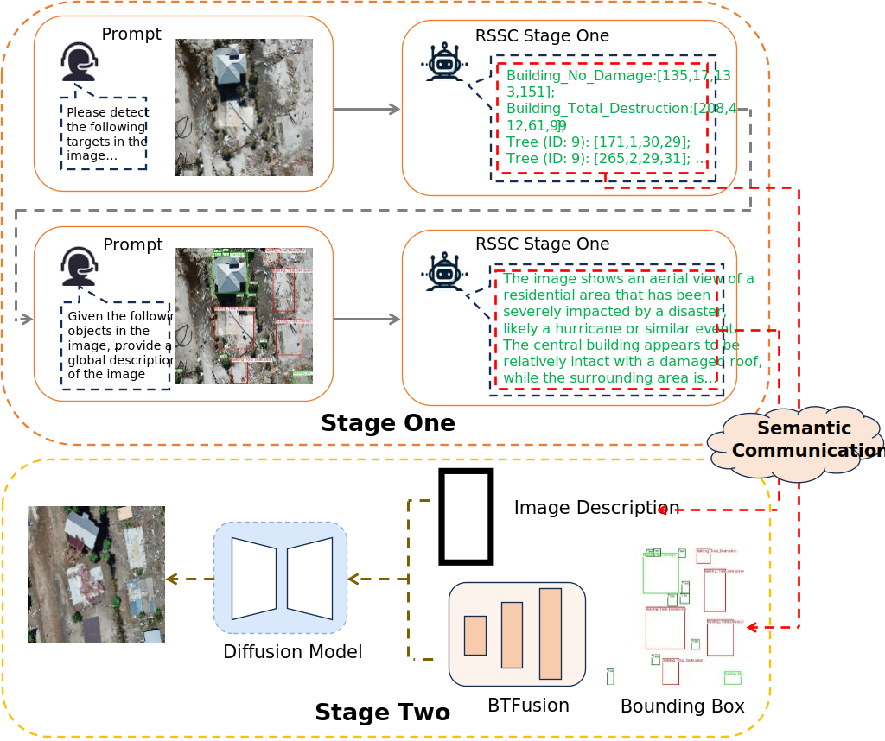

# RSSC: A Byte-Level Semantic Communication Method for Visual Information Transmission in Communication-Constrained Remote Sensing Scenarios

[](https://github.com/anonymous-rssc/rssc)
[](https://www.python.org/)
[](https://pytorch.org/)
[](LICENSE)

> **TL;DR:** RSSC is a two-stage semantic communication framework that encodes remote sensing images into byte-level textual data and reconstructs them with diffusion models, achieving state-of-the-art compression and reconstruction quality.

---

<p align="center">
  
  <br>
  <em><strong>RSSC System Overview.</strong> Stage One encodes images into textual descriptions and bounding boxes; Stage Two reconstructs images from the transmitted text.</em>
</p>

---

## 📋 TODO

This repository is currently under active development. The following items will be released upon paper acceptance:

- [x] Project page and documentation
- [ ] Complete source code (Stage One & Stage Two)
- [ ] Pre-trained model weights
- [ ] Training datasets and preprocessing scripts
- [ ] Evaluation scripts and benchmarks
- [ ] Docker deployment support

> **Note:** The paper is currently under review. Full code and model weights will be released after the review process is complete.

---

## 🛠️ Environment Setup

### Prerequisites

- Python >= 3.10
- CUDA >= 11.8
- Git

### Installation

```bash
# 1. Clone the repository
git clone https://github.com/anonymous-rssc/rssc.git
cd rssc

# 2. Create conda environment
conda create -n rssc python=3.10 -y
conda activate rssc

# 3. Install dependencies
pip install -r requirements.txt
```

---

## 🚀 Usage

### Stage One: Semantic Encoding

Stage One extracts key target information (bounding boxes + categories) and generates global textual descriptions using a fine-tuned MLLM.

#### Inference

**Target Detection:**
```bash
python stage_one/detect_infer.py \
    --image_path "path/to/image.jpg" \
    --checkpoint "path/to/stage_one_checkpoint" \
    --output_dir "./outputs/detection"
```

**Global Description Generation:**
```bash
python stage_one/describe_infer.py \
    --image_path "path/to/image.jpg" \
    --detection_result "./outputs/detection/result.json" \
    --checkpoint "path/to/stage_one_checkpoint" \
    --output_path "./outputs/description.txt"
```

#### Training

```bash
# Multi-GPU (recommended)
deepspeed --num_gpus=4 stage_one/train.py \
    --deepspeed configs/ds_config_stage1.json \
    --model_name_or_path "Qwen/Qwen2.5-VL-7B-Instruct" \
    --dataset_path "path/to/rsod_dataset" \
    --output_dir "./checkpoints/stage_one"
```

---

### Stage Two: Image Reconstruction

Stage Two reconstructs remote sensing images from textual descriptions and bounding box information using Stable Diffusion with BTFusion.

#### Inference

```bash
python stage_two/reconstruct.py \
    --description_path "./outputs/description.txt" \
    --bbox_path "./outputs/detection/result.json" \
    --checkpoint "path/to/stage_two_checkpoint" \
    --output_path "./outputs/reconstructed.jpg"
```

#### Training

```bash
# Multi-GPU (recommended)
deepspeed --num_gpus=4 stage_two/train.py \
    --deepspeed configs/ds_config_stage2.json \
    --pretrained_model_name_or_path "runwayml/stable-diffusion-v1-5" \
    --dataset_path "path/to/rsod_dataset" \
    --output_dir "./checkpoints/stage_two"
```

---

## 📁 Project Structure

```
rssc/
├── stage_one/                  # Stage One: Semantic Encoding
│   ├── train.py               # Training script with sLoRA
│   ├── detect_infer.py        # Target detection inference
│   ├── describe_infer.py      # Description generation inference
│   └── model/                 # Model definitions
│
├── stage_two/                  # Stage Two: Image Reconstruction
│   ├── train.py               # Training script with BTFusion
│   ├── reconstruct.py         # Reconstruction inference
│   └── model/                 # Model definitions
│
├── configs/                    # Configuration files
│   ├── ds_config_stage1.json
│   └── ds_config_stage2.json
│
├── requirements.txt
├── README.md
└── LICENSE
```

---

## 🎯 Results

### Stage One: Target Detection

| Dataset | Precision | Recall | F1-Score |
|---------|-----------|--------|----------|
| RSOD    | 0.9899    | 0.9423 | **0.9655** |
| RescueNet | 0.9402  | 0.6995 | **0.8022** |

### Stage Two: Image Reconstruction

| Dataset   | FID ↓  | SSIM ↑  |
|-----------|--------|---------|
| RSOD      | 42.87  | 0.1482  |
| RescueNet | 40.79  | 0.1513  |

---

## 📄 License

This project is licensed under the Apache License 2.0 - see the [LICENSE](LICENSE) file for details.

---

## 🤝 Acknowledgements

This work builds upon the following excellent open-source projects:

- [Qwen2.5-VL](https://github.com/QwenLM/Qwen2.5-VL) - Multimodal large language model
- [InstanceDiffusion](https://github.com/frank-xwang/InstanceDiffusion.git) - Instance-level controllable image generation

---

<p align="center">
  <em>Built with ❤️ for the remote sensing community</em>
</p>
